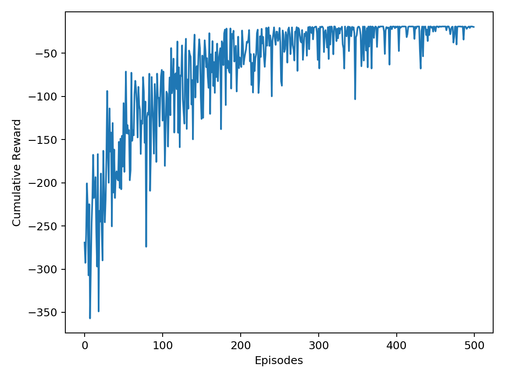
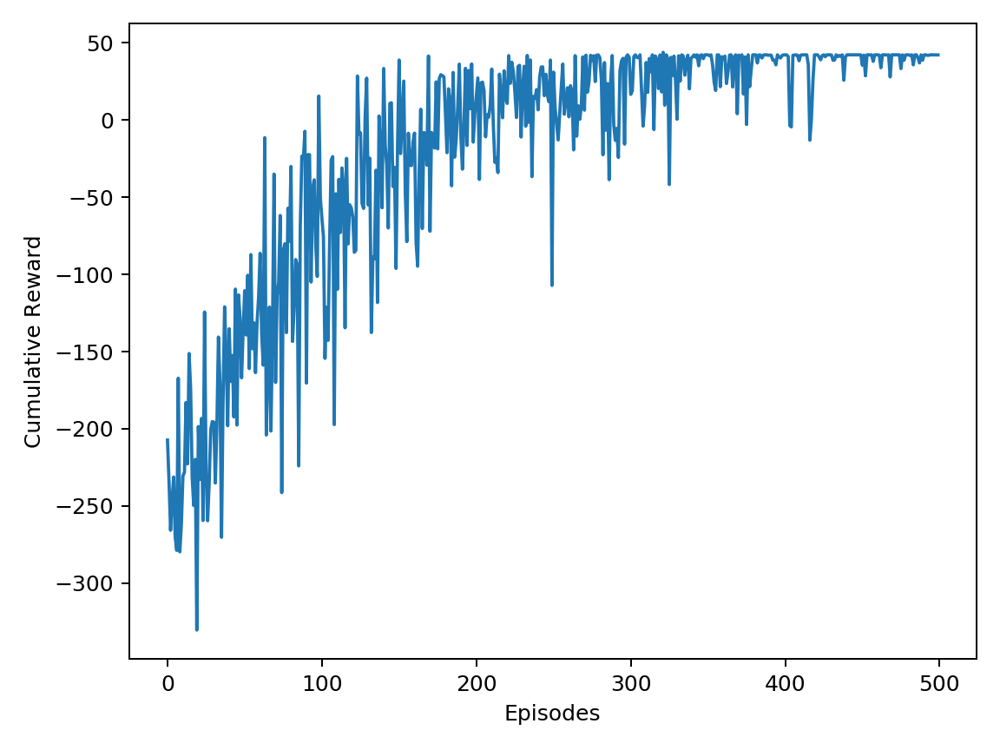

# HW3 — Reinforcement Learning (Q-Learning)

This project trains an agent in the AAIRobots environments using Q-learning with epsilon-greedy exploration.

## Evidence of learning
Reward vs. episode curves (generated from `qlearning.csv`):

### cafeWorld


### bookWorld


## Notes on stochastic transitions
The environment can be stochastic (some actions may result in no state change). This shows up as:
- More steps per episode
- More negative cumulative reward early in training
Over time, as the policy improves (and exploration decays), the agent learns action choices that reach the goal in fewer steps, improving cumulative reward.

## Files
- `plots/qlearning.csv` — training log
- `plots/qlearning_cafeWorld.png` / `plots/qlearning_bookWorld.png` — reward curves

## How to run (ROS)
```bash
rosrun hw3 qlearning.py --submit
